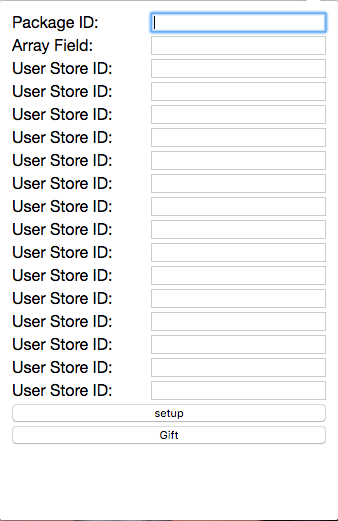

# cydia-gift-chrome-extension
Completely gross and unsupported Chrome extension to gift Cydia Store packages

## Screenshot

  

## NOTE

* change your own tweaks identifer inside popup.js file line 16

## How to use

* change packageFromText inside popup.js
* open google chrome
* go to chrome://extensions/
* enable Developer mode ( if not enabled already )
* click Load unpacked extension...
* choose cydia-gift-chrome-extension path
* click on the extension icon
* separate all ids with comma, ex: 633674,5602631,4497721
* paste them inside Array Field: 
* click setup button
* then once it finish click on Gift button
* wait till finish ( DONE )

## Credits

* Ryan Petrich
* iMokhles ( for supprting array with identifiers )
